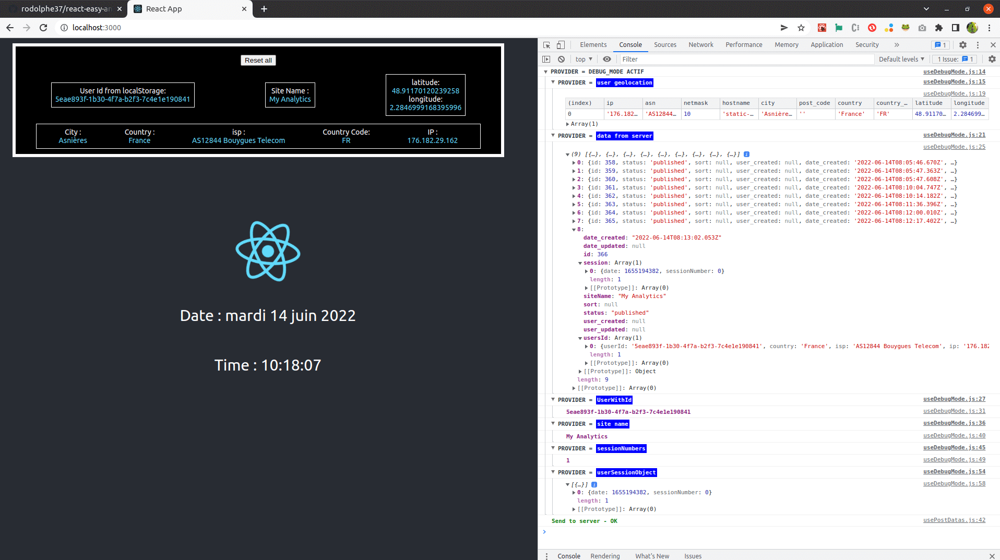
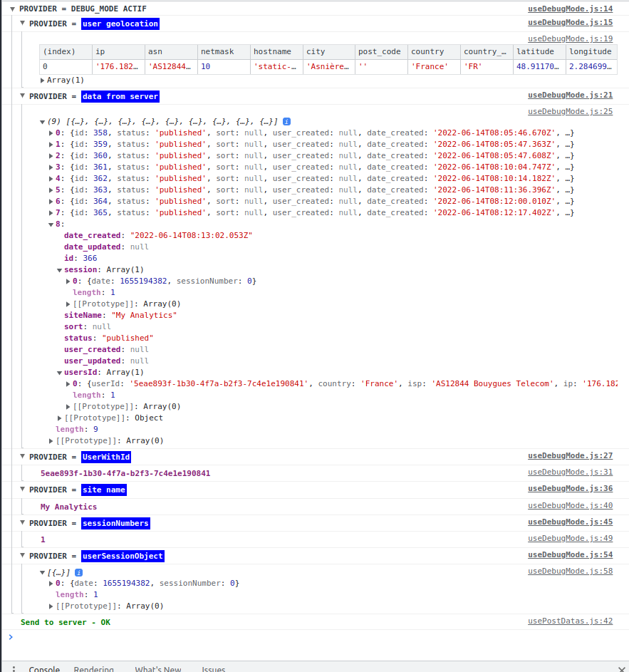

#

---

# React-easy-analytics

> This module is **_ in phase 1 of development (just beginning project), all developers who wish to join me in this project are welcome_** &
> the code is **_open sources_**!

---

## :computer: Online Demo

**You can test this app in debug mode** **[here](react-analytics.netlify.app/)**

---

### :bookmark: What is React-easy-analytics?

> After the cnil release about google analytics data leakage, I thought about a React alternative that would work internally (a Npm module, not Matomo or other alternatives), or it would only be necessary to wrap the app with a provider with a few parameters, then integrate a consumer.
>
> - All the identification actions are in the provider, and
> - all the actions concerning session data are in the consumer.

### DEBUG_MODE demo

---

**:heavy_exclamation_mark: Dashboard Provider & consumer :heavy_exclamation_mark:**
Then, to have a Dashboard component (to be integrated into the back-office) that displays all the data quickly and simply.

---

### The provider's info at this stage of development:

---

## :bust_in_silhouette: Author

- Thought, designed and developed with :purple_heart: by Rodolphe Augusto

---

## :large_blue_diamond: A few words from the author

Enjoy the World :smirk:

---

## :sparkling_heart: Support or contribute to the project

---

If any developers want to join me on this open source project, send me a message. You are welcome.

---

I put almost everything open-source I can, and try to accommodate anyone who needs help using these projects. Obviously,
this takes time. You can use this service for free.

However, if you are using this project and are happy with it or just want to encourage me to keep creating: -

- Put a star and share the project :rocket:

Thank you! :heart:

---

## :scroll: License

MIT

---

## My other projects:

> ### My Simple Tutorial Creator
>
> https://github.com/rodolphe37/my-simple-tutorial-creator

> ### My Simple Task Manager
>
> https://github.com/rodolphe37/my-simple-tasks-manager-

> ### My Simple Cam
>
> https://github.com/rodolphe37/my-simple-cam-dektop-app

> ### App for decrypt greenPass europe QRcode
>
> https://github.com/rodolphe37/qrcode-decoder

> ### Css animation with Create React App base.
>
> https://github.com/rodolphe37/halloween2021-bat-tuto-youtube-video

> ### My GitHub "open Sources" project
>
> https://github.com/rodolphe37/pwa-react-project

> ### cra-template-github-my-profile
>
> https://github.com/rodolphe37/cra-template-github-my-profile

> ### My Awesome Custom Alert
>
> https://github.com/rodolphe37/my-awesome-custom-alert

> ### Geolocation starter app React-native
>
> https://github.com/rodolphe37/react-native_geolocation-tracker

> ### Classic React Ultimate Messenger version repository (for open sources contributors)
>
> https://github.com/rodolphe37/rum-open-sources

> ### React Ultimate Messenger template for React (create-react-app tools)
>
> https://github.com/rodolphe37/cra-react-ultimate-messenger

> ### PWA React Ultimate Messenger template for React (create-react-app tools)
>
> https://github.com/rodolphe37/cra-pwa-react-ultimate-messenger

> ### installation and initialization shell script for the PWA React Ultimate Messenger template
>
> https://github.com/rodolphe37/pwa-rum-install-pack

> ### Upload-image-profil-component
>
> https://github.com/rodolphe37/Upload-image-profil-component

> ### Jeux libres de droits "open Sources" - Memory Yoga Cards Game - Sort the Waste Game - Match 3 Yoga Game - Tetris Classic Game - Remake Earth Puzzle Game
>
> https://github.com/rodolphe37/install-games-repository

> ### Administration template - React JS & react-admin
>
> https://github.com/rodolphe37/nfc-updates-front

> ### Administration template Backend - Node & Express
>
> https://github.com/rodolphe37/nfc-updates-back

---
